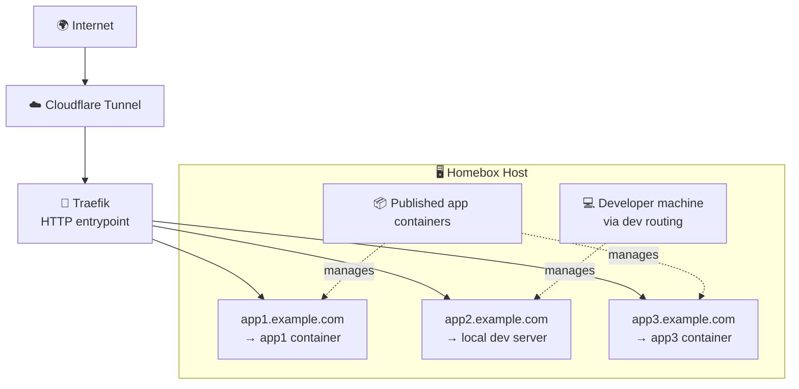
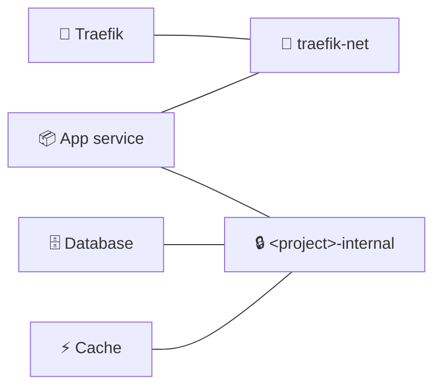

<p align="center">
  
</p>

# 📦 Homebox

**[homebox.sh](https://homebox.sh)**

A self-hosted Internal PaaS for deploying and managing containerized applications. Homebox runs on any machine with Docker (Linux, macOS, or Windows), uses Traefik as a reverse proxy, Cloudflare Tunnel for internet exposure, and provides a CLI for developers to switch between local development and published container routing.

<a id="quick-start"></a>
## 🚀 Quick Start

Install on any machine with a single command:

**macOS / Linux:**
```bash
curl -fsSL https://homebox.sh/install.sh | bash
```

**Windows (PowerShell, no Administrator needed):**
```powershell
powershell -ExecutionPolicy Bypass -c "irm https://homebox.sh/install.ps1 | iex"
```
Verifies Docker Desktop + WSL2, runs the same installer inside your default WSL distro,
then opens the admin UI at `http://localhost:7765` from Windows.

The installer will:
1. Check for (or install) Docker
2. Create the Homebox directory structure
3. Generate admin credentials (saved to `~/.homebox/secrets.json`)
4. Bring up the **Homebox Admin UI** on `http://localhost:7765`
5. Open your browser: domains, Cloudflare tunnel, GitHub runner, and projects are all configured from there

**Uninstall** — the same installer with `--uninstall`. By default it keeps your data
volumes and `~/.homebox` secrets so a reinstall adopts them; add `--purge` to wipe those too:

```bash
# macOS / Linux
curl -fsSL https://homebox.sh/install.sh | bash -s -- --uninstall --yes --purge
```
```powershell
# Windows (parameters can't cross an irm|iex pipe, so invoke it as a scriptblock)
powershell -ExecutionPolicy Bypass -c "& ([scriptblock]::Create((irm https://homebox.sh/install.ps1))) -Uninstall -Yes -Purge"
```

## 🏗️ Architecture



Each project runs in its own Docker Compose stack with isolated networking:

- **🔗 `traefik-net`** (shared): connects project containers to Traefik for HTTP routing
- **🔒 `<project>-internal`** (per-project): connects app, database, and cache containers privately

Backing services (Postgres, Redis) are never exposed to the host network.

### Network Layout



## 🗂️ Project Structure

```
host/
├── install.sh / install.ps1       # One-liner installers
├── cli/                           # Python CLI for developers
│   ├── homebox_cli/
│   │   ├── main.py                # Commands: init, switch, db sync
│   │   ├── config.py              # ~/.homebox.json management
│   │   ├── network.py             # Local IP detection
│   │   ├── ssh.py                 # SSH client for remote operations
│   │   └── traefik.py             # Traefik config file manipulation
│   └── pyproject.toml
├── host-provisioner/
│   ├── base-infrastructure/
│   │   ├── docker-compose.yml     # Traefik service definition
│   │   ├── .env.example           # Host configuration template
│   │   └── dynamic_conf.yml       # Traefik dynamic routing rules
│   ├── lib.sh                     # Shared utilities (colors, platform detection)
│   ├── setup_host.sh              # Host provisioning script
│   └── configure.sh               # Interactive configuration
└── docs/
    ├── homebox-ready.md           # Making a project Homebox-compatible
    └── claude-bootstrap-skill.md  # LLM guide for scaffolding projects
```

## 🛠️ Host Setup

### Prerequisites

- **🖥️ Any machine**: Linux, macOS (including Mac Mini), or Windows
- **🐳 Docker**: Docker Engine on Linux, Docker Desktop on macOS/Windows
- **🌐 Cloudflare-managed domain**: required for tunnel access

### One-liner install (recommended)

See [Quick Start](#quick-start) above. The installer handles everything interactively.

### Manual setup

If you have the repo cloned, the simplest path is the Makefile:

```bash
make host        # provision (chains into interactive configure)
make configure   # re-run configuration only
```

Or invoke the provisioner directly:

```bash
# Linux (requires sudo)
sudo ./host/host-provisioner/setup_host.sh

# macOS (no sudo required)
./host/host-provisioner/setup_host.sh
```

The provisioner installs Docker, creates the directory structure, deploys base infrastructure files, creates the `traefik-net` Docker network, and launches the interactive configurator.

**Default paths:**
| Platform | Base directory |
|----------|---------------|
| Linux    | `/opt/homebox` |
| macOS    | `~/homebox` |
| Windows  | `%USERPROFILE%\homebox` |

Override with `HOMEBOX_BASE_DIR` environment variable.

To re-run just the admin bootstrap (regenerate `.env`, redeploy):

```bash
make configure
```

### 🛡️ Admin UI

After `make host` completes, open the public admin URL printed at the end of setup (e.g. `https://homebox.<your-domain>`) or fall back to `http://localhost:7765` on the host. The admin UI is a React SPA built into the admin container; it talks to the FastAPI backend at `/api/*`. Login uses the same hashed credentials in `~/.homebox/secrets.json`.

- **Username**: `homebox` (configurable via `~/.homebox/secrets.json`)
- **Password**: random 24-char, generated on first run, saved to `~/.homebox/secrets.json` (mode 600), printed once to the terminal

The same credentials guard:
- The admin UI (Traefik basic-auth + app-side check)
- The Traefik dashboard, when exposed via a configured domain
- The Postgres backing the admin (port `5399` on the host, only useful for local debugging)

To rotate, edit `~/.homebox/secrets.json` and run `make configure` to regenerate the htpasswd hash.

### 🌐 Domains

The admin UI's **Domains** page accepts two modes per domain:

- **wildcard**: child subdomains are auto-routed to projects: `myapp.x100.dev` → the `myapp` project. Multiple wildcard domains are supported (`x100.dev`, `calmlogic.dev`, …).
- **dedicated**: the domain itself (and `*.<domain>`) is bound to one specific project. Use this for customer-facing or branded domains.

Domains are persisted to `/opt/homebox/base-infrastructure/domains.json`. The Tunnel page renders a ready-to-paste `cloudflared` config and DNS-routing commands for the host.

### 🤖 GitHub Actions runner

Connect a GitHub organization with a fine-grained PAT (`repo` + `admin:org` scopes) on the **Organizations** page. The **Runner** page can mint registration tokens via the API and lists the host's runner registration. Org-scoped runners are recommended; every repo in the org can target the host via:

```yaml
runs-on: [self-hosted, homebox]
```

GitHub does not support user-account-scoped runners; to share a runner across personal repos, move them under an organization.

## 👩‍💻 Developer Setup

### Install the CLI

```bash
pip install ./host/cli
```

### Initialize

```bash
homebox init
```

This prompts for:
- Host server LAN IP
- SSH username and key path
- Cloudflare domain
- Traefik config path (default: `/opt/homebox/traefik/dynamic_conf.yml`)
- Projects directory (default: `/opt/homebox/projects`)

Configuration is saved to `~/.homebox.json`.

## ⌨️ CLI Usage

### Switch routing modes

Route a project subdomain to your local development server:

```bash
homebox switch myapp dev --port 8000
```

Route back to the published container on the host:

```bash
homebox switch myapp pub
```

The CLI connects to the host via SSH and updates Traefik's dynamic configuration file. Changes take effect immediately.

### Sync a database locally

Pull a project's database from the host to your local machine:

```bash
homebox db sync myapp
```

With explicit options:

```bash
homebox db sync myapp --db myapp_db --user myapp_user --local-db myapp_dev --container myapp-db-1
```

## 🔄 Development Workflow

1. **Start developing**: run your app locally and switch routing to dev mode:
   ```bash
   homebox switch myapp dev --port 8000
   ```
   Your app is now accessible at `myapp.example.com`, routed to your machine.

2. **Sync production data** (optional):
   ```bash
   homebox db sync myapp
   ```

3. **Deploy**: push to your branch. GitHub Actions runs tests in the cloud, then deploys to your host:
   ```bash
   homebox switch myapp pub
   ```

## 🧰 Tech Stack

| Component | Technology |
|-----------|-----------|
| Reverse proxy | Traefik v3 |
| Tunneling | Cloudflare Tunnel |
| Containers | Docker & Docker Compose |
| Database | PostgreSQL 16 |
| Cache | Valkey (Redis-compatible) 7 |
| CLI | Python 3.10+, Typer, Paramiko |
| CI/CD | GitHub Actions (tests in cloud, deploy on self-hosted runner) |
| Host platforms | Linux, macOS, Windows |
