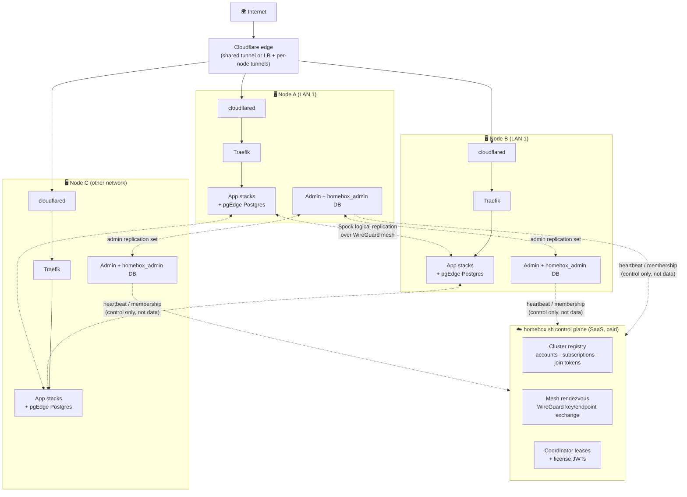
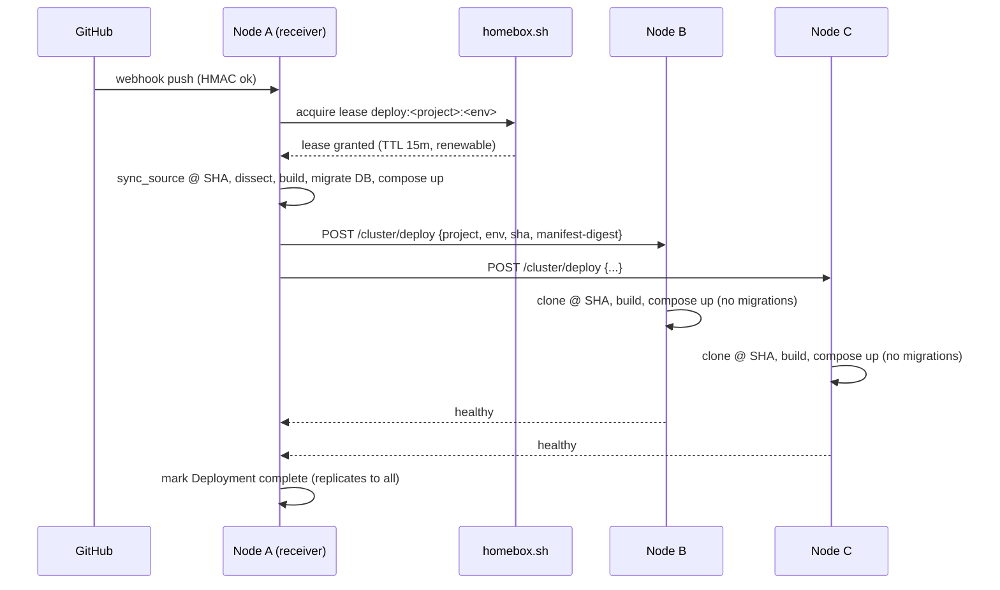

# 🕸️ Homebox Clusters — Architecture & Implementation Plan

Status: **PHASE 1 SLICE IMPLEMENTED** (2026-07-04) — see §0 below. Original design follows.

---

## 0. What's implemented (EOD slice, 2026-07-04)

A working 2-node-LAN slice of Phases 1–3, cut for speed (deviations noted):

| Piece | Where | Deviation from the design below |
|---|---|---|
| Control plane (registry, join tokens, heartbeats/rendezvous, grants, dev licenses) | hosted service — `control.homebox.sh` (proprietary; not in this repo) | Accounts are dev-stubbed (any bearer token); Stripe + license JWTs later |
| Node identity + sealed key exchange | `admin/app/clusterlib.py`, `crypto.py` | X25519 sealed box exactly as designed; cluster keys land in `/opt/homebox/admin/cluster-keys.json` + self-restart instead of mTLS CA (CA later) |
| Peer API | `admin/app/routes/peer.py` | Routed through Traefik :80 via Host `homebox-peer.internal` — no WireGuard mesh yet (LAN-only trust, HMAC bearer) |
| Config replication | `admin/app/cluster_sync.py` | API-based natural-key sync (full/deploy/update modes) instead of Spock-on-admin-DB; deletions don't propagate yet |
| Deploy fan-out + catch-up | `deploy.py` + `clusterlib.reconcile_deployments` | Receiving node coordinates (no lease service yet); peers pull config with the deploy |
| Ingress Mode 1 (shared tunnel) | free via config sync | connector token syncs in the Integration row; each node's monitor launches cloudflared |
| App-DB active-active (pgEdge Spock) | `admin/app/cluster_db.py` | DDL replication OFF by design — every node deploys+migrates the same app, only DML replicates. PK-less tables → insert-only repset. Serial PKs unsupported (use UUIDs/snowflake) |
| Large-object replication (pgEdge lolor) | `admin/app/cluster_db.py` | Native `pg_largeobject` is a catalog → logical replication skips it. `lolor` reroutes the `lo_*` API into replicable `lolor.*` tables (default repset); `lolor.node = <spock ordinal>` node-encodes new LO oids (collision-free multi-master). Set in postgresql.conf, NOT ALTER SYSTEM (prefix unknown until module load). Caveats: no ALTER/GRANT/COMMENT ON LARGE OBJECT; pre-extension LOs stay node-local until migrated |
| Cluster UI | `admin/frontend/src/pages/Cluster.tsx` | create/join/mint-token/roster/leave; reachable pre-onboarding for fresh joiners |

Replication is ON BY DEFAULT for clustered nodes (2026-07-04 evening) —
apps run unchanged in single-node or cluster mode. Per-app opt-OUT via
`homebox.yaml`:

```yaml
cluster:
  database: none
```

Platform absorbs the multi-master requirements: bigint sequences auto-convert
to snowflake at wiring time (int4 serials warn in the deploy log);
single→cluster transitions dump/restore existing data automatically
(coordinator dumps pre-deploy, peers pick it up via synchronize_data on their
first empty-DB subscription); a node leaving the cluster keeps serving its
replicated-era data (residual pgEdge volume).

Added 2026-07-04 (evening):
- **Leave & disconnect**: peers drop their subscriptions to the leaver (WAL
  slots released), local subs dropped, tunnel connector stopped + token
  forgotten, optional stack teardown, deregister. Eviction for dead nodes;
  the reconcile loop drops subs to any ordinal no longer in the roster.
- **Permanent node ordinals** assigned by the control plane (never reused);
  sub names follow the database's baked spock identity so leave+rejoin
  can't duplicate subscriptions.
- **Account-based UX**: link a node to a homebox.sh account once; from any
  node see all linked nodes + clusters, create/join with one click, and
  invite other nodes (directive delivered on their next poll → auto-join).
  Join tokens remain as the manual fallback.

Not yet: WireGuard mesh (cross-network clusters), CF Load Balancer Mode 2,
admin-DB Spock replication, deletion propagation, lease-serialized deploys,
volume/object storage, Stripe entitlements, cluster-key rotation on leave.

---

Extend Homebox from a single-node internal PaaS to an **active-active cluster**: multiple
Homebox nodes (on one LAN or across networks) that all serve the same applications, with
traffic distributed across them and state kept in sync via logical replication.
Cluster membership is centrally coordinated by **homebox.sh** (account + paid subscription
required); the data plane is fully peer-to-peer and keeps working if homebox.sh is
unreachable.

---

## 1. Goals & non-goals

**Goals**

- Join a fresh or existing Homebox node to a cluster with one token paste.
- Every node runs every (cluster-enabled) app; requests can land on any node ("active-active").
- Ingress traffic distributed across nodes — HA by default, true round-robin/random optionally.
- Postgres app data replicated multi-master via [pgEdge Spock](https://github.com/pgEdge/spock)
  (PostgreSQL License since 2025-09; PG 15–18).
- Homebox control state (projects, domains, env vars, integrations) replicated cluster-wide.
- Nodes keep serving traffic when peers or homebox.sh are down (async, eventually consistent).
- Subscription-gated: cluster features require a homebox.sh account with an active plan.

**Non-goals (v1)**

- Synchronous replication / strict consistency. Everything is async multi-master + conflict
  resolution (last-write-wins). Apps that need serializable cross-node writes are out of scope.
- Active-active Redis/Valkey. Caches stay node-local (see §7.3).
- Automatic sharding or partial placement. v1 is "every node runs everything"; pinned
  (singleton) projects are the escape hatch for stateful volume workloads (§7.4).

---

## 2. Current single-node facts the design builds on

| Fact | Where | Cluster implication |
|---|---|---|
| Admin state in per-node Postgres (`homebox_admin`), no Alembic | `admin/app/models.py`, `db.py` | Needs migrations + replication sets; schema must match across nodes |
| Secrets Fernet-encrypted with per-node `ENCRYPTION_KEY` | `configure.sh`, `crypto.py` | Naive DB replication yields undecryptable blobs on peers → cluster-shared key (§5.2) |
| `install_id` in `settings`, tags CF tunnels | `routes/tunnel.py:32` | Natural node identity seed |
| cloudflared runs token-only, remotely-managed; ingress PUT to CF API | `cloudflare.py`, `host.py:312` | Same connector token can run on N nodes today (replica mode); ingress push must be single-writer |
| Deploys: webhook → local `docker compose up` on own daemon | `deploy.py`, `routes/webhooks.py` | Webhook lands on ONE node; needs cluster deploy fan-out (§8) |
| No machine-to-machine auth (session cookies only) | `auth.py` | New node credential + mTLS required (§5) |
| `homebox.sh` already exists as a stateless OAuth broker | `oauth-proxy/` | Pattern & domain for the cluster control plane (§4) |

---

## 3. Architecture overview



**Design principle — control plane vs data plane.** homebox.sh handles *membership, identity,
billing, and rendezvous only*. Replication traffic, deploy fan-out, and app traffic flow
node-to-node over an encrypted mesh. If homebox.sh is down: no joins/removals, licenses
enter a grace period, but apps, replication, and deploys keep working. Customer data never
transits homebox.sh.

---

## 4. Control plane: homebox.sh cluster service

New service (sibling of the existing `oauth-proxy`), with real state (accounts DB) and Stripe
billing. API surface (all JSON, versioned `/v1`):

| Endpoint | Purpose |
|---|---|
| `POST /clusters` | Create cluster (auth: homebox.sh account; checks subscription entitlement) |
| `POST /clusters/{id}/join-tokens` | Mint short-lived (48h), single-use join token |
| `POST /clusters/{id}/nodes` | Node join: presents join token + its public key; returns cluster manifest |
| `DELETE /clusters/{id}/nodes/{node_id}` | Evict node (marks for peer-side subscription teardown) |
| `POST /clusters/{id}/heartbeat` | Node heartbeat (~60s): version, health, WG endpoint; returns peer roster delta |
| `POST /clusters/{id}/leases/{name}` | Coordinator lease (deploy coordinator, ingress writer) — TTL lease, renewable |
| `GET /clusters/{id}/license` | Signed license JWT: `{cluster_id, max_nodes, features, exp}` |

**Identity model**

- **Cluster**: `cluster_id` (UUID), owned by a homebox.sh account, bound to a subscription
  (plan sets `max_nodes`).
- **Node**: reuses `install_id` as `node_id`. At join, the node generates an Ed25519 keypair;
  homebox.sh records the public key and issues a **node certificate** (signed by a per-cluster
  CA that homebox.sh operates). Node cert is used for mTLS on the intra-cluster API and to
  authenticate WireGuard key exchange.
- **License JWT**: nodes cache it and re-fetch daily. Signature verified against pinned
  homebox.sh keys. Expired + grace period (14 days) exceeded → cluster UI shows "unlicensed",
  joins are refused, **running apps and replication are never stopped** (don't brick paying
  customers who lapsed; degrade management, not workloads).

**Enforcement point.** Everything cluster-y in the node admin (join, add-node UI, mesh
rendezvous, coordinator leases) requires a valid license JWT. Single-node Homebox remains
free and untouched.

---

## 5. Node identity, trust & mesh networking

### 5.1 Machine-to-machine auth

New intra-cluster API on each node's admin app, mounted at `/cluster/*` (separate from the
session-cookie `/api/*`):

- mTLS with per-node certs from the cluster CA (§4). Terminated by the admin app itself on a
  mesh-only port — never exposed through Traefik/tunnel.
- Endpoints: `GET /cluster/state-digest`, `POST /cluster/deploy` (fan-out, §8),
  `GET /cluster/deployments/{id}/log`, `GET /cluster/metrics`, `POST /cluster/evict`.

### 5.2 Cluster-shared encryption key

The Fernet `ENCRYPTION_KEY` becomes **cluster-scoped**: the founding node's key is the
cluster key. At join, the joining node receives it sealed to its Ed25519 key (X25519 sealed
box), delivered peer-to-peer during the handshake — homebox.sh sees only ciphertext it cannot
open (it knows the node public key but the seal is to the node's private key). The joining
node re-encrypts any pre-existing local secrets, swaps `.env`, restarts. From then on all
`secret_encrypted` blobs (GitHub PATs, CF tokens, webhook secret) replicate cleanly.

### 5.3 WireGuard mesh ("clusternet")

Replication and intra-cluster API need L3/L4 connectivity across NATs. Ship an embedded
WireGuard overlay:

- Each node runs a `homebox-mesh` container (WireGuard, `wg` + lightweight agent) with a
  stable cluster-private IP (`10.77.x.y/16`, derived from node index).
- Key/endpoint exchange via homebox.sh rendezvous (heartbeat carries observed public
  endpoint; UDP hole-punching attempted; **same-LAN nodes short-circuit to LAN IPs**).
- v1 fallback when NAT traversal fails: one node needs a reachable UDP port (documented);
  v2: homebox.sh-operated DERP-style relay (paid-tier justification).
- Postgres replication ports, the intra-cluster API, and the deploy log stream bind to the
  mesh IP only. Nothing new is exposed on LAN/WAN.

Why not Cloudflare Tunnel for node-to-node? cloudflared TCP origins require `cloudflared
access` client sessions per connection, add edge round-trips to what may be same-LAN
replication, and put customer replication traffic through a third party. WireGuard is
direct, fast on LAN, and boring.

---

## 6. Ingress: traffic distribution across nodes

Two modes, selectable per cluster on the Tunnel page:

### Mode 1 — Shared tunnel, replicas (default; included in base CF plan)

All nodes run cloudflared with the **same connector token** (which replicates via the
Integration row once §5.2 lands — each node's `monitor.py` ensures a local
`homebox-cloudflared`). Cloudflare routes each request to the **geographically closest
healthy connector and fails over automatically** — this is HA + coarse distribution, **not
round-robin**; Cloudflare documents that
[replicas do not support traffic steering](https://developers.cloudflare.com/cloudflare-one/networks/connectors/cloudflare-tunnel/configure-tunnels/tunnel-availability/).
For a same-city LAN cluster the practical effect is roughly balanced; for multi-region it
biases to the nearest node (usually desirable).

### Mode 2 — Per-node tunnels + Cloudflare Load Balancer (true round-robin / random)

For explicit steering, Homebox provisions **one tunnel per node** (named
`homebox-<cluster>-<node>`, tagged with `node_id`) and manages a
[Cloudflare Load Balancer](https://developers.cloudflare.com/cloudflare-one/networks/connectors/cloudflare-tunnel/routing-to-tunnel/public-load-balancers/):
one pool with each node's `<tunnel_id>.cfargotunnel.com` as an origin, health monitor
probing a new `GET /healthz` on Traefik, steering policy `random` / `round_robin`, optional
**session affinity** (needed for apps with node-local session/cache state, §7.3). Wildcard
DNS records point at the LB hostname. Requires the customer's Cloudflare LB add-on
(paid, ~$5/mo+) — surfaced in the UI as a requirement check.

**Ingress single-writer.** Ingress config and LB pool membership are pushed to the CF API
only by the node holding the `ingress-writer` lease (§4) to avoid write races. Any node can
*request* a change (domain added, node joined); the writer reconciles.

### Cross-node fallback inside a node

Traefik on each node gets a file-provider fallback: if a project's local containers are
unhealthy, proxy to a peer's Traefik over the mesh (`http://10.77.x.y:80`) with the same
Host header. Cheap insurance during deploys and partial failures.

---

## 7. State synchronization

### 7.1 Homebox control state (admin DB) — Spock with replication sets

Dogfood the same replication tech used for apps. The admin Postgres image moves to a
pgEdge/Spock-enabled `postgres:16` build. Tables are classed:

| Class | Tables | Strategy |
|---|---|---|
| **Cluster-replicated, multi-writer** | `integrations`, `projects`, `environments`, `services`, `service_env_vars`, `domains`, `identities`, cluster-scoped `settings` keys | Spock replication set `homebox_cluster`; conflicts = last-update-wins (fine for config: rare concurrent edits, admin UI shows revision) |
| **Cluster-replicated, single-writer** | `deployments`, `service_instances` (+ new `node_id` column) | Each row written only by its owning node → conflict-free by construction; replication gives every node the full cluster dashboard |
| **Node-local** | `metric_samples`, `uptime_samples`, `workflow_runs_cache`, node-scoped settings (`install_id`) | Not replicated (too chatty / meaningless remotely); UI fans out via intra-cluster API when drilling into a node |

Prerequisites this forces (good hygiene anyway):

- **Introduce Alembic.** Spock requires matching schemas; "create tables on boot" can't
  coordinate upgrades. Cluster upgrade rule: admin version skew allowed for reads, schema
  migrations applied cluster-wide by the deploy coordinator before any node runs new code.
- **Snowflake sequences** (pgEdge `snowflake` extension) or UUID PKs for the replicated
  tables, so inserts on different nodes never collide.
- `settings` splits into cluster-scoped vs node-scoped keys (two tables or a `scope` column).

*Alternative considered:* homebox.sh as source of truth for config, nodes sync down.
Rejected — makes the SaaS a hard dependency for every config change and centralizes
customer config, against Homebox's self-hosted ethos. homebox.sh stays membership-only.

### 7.2 Application databases — pgEdge Spock per project

For projects opted into clustering (via `homebox.yaml`):

```yaml
# homebox.yaml
cluster:
  enabled: true
  database:
    replication: active-active   # or: none | pinned
    conflict_resolution: last_update_wins
```

Deploy-time transformation in `dissect.py` / `_assemble_stack`:

1. **Image swap**: detected `postgres*`/`postgis` services are re-based onto the Homebox
   pgEdge image (`homebox/pgedge-postgres:16`, i.e. upstream postgres + `spock` +
   `snowflake` extensions preinstalled), preserving major version. Non-Postgres databases
   (mysql/mongo) are **not supported** for replication in v1 → project falls back to
   `pinned` with a UI warning.
2. **Spock bootstrap** (idempotent init container per deploy):
   `CREATE EXTENSION spock; spock.node_create('n<node_id>', dsn=<mesh IP>)`;
   `spock.repset_add_all_tables()`; `spock.sub_create(...)` to every peer, with
   `synchronize_data = true` for a joining node (initial sync from one donor peer).
3. **Sequences**: enable auto-conversion to snowflake sequences; dissect warns loudly if the
   schema uses plain `serial` and the app hasn't acknowledged `cluster.enabled`.
4. **DDL / migrations**: Spock's automatic DDL replication is enabled; app migrations run
   **only on the deploy-coordinator node** (§8) and replicate out. Peer nodes' app containers
   start gated on a schema-version check.
5. **Replication network**: the project's Postgres joins an additional
   `homebox-mesh` network; its port is published **only on the mesh IP** at a
   deterministic per-project port. Credentials: per-project replication role, password
   stored encrypted in the (now-replicated) admin DB.

**Semantics apps must accept (documented in `homebox-ready.md`):** async multi-master;
last-update-wins on conflicting rows; delta-apply available for counter columns; no
cross-node unique-constraint guarantees beyond PKs (design keys accordingly, e.g.
usernames enforced by natural PK); replication lag = seconds under normal conditions.

### 7.3 Valkey/Redis — node-local by default

No CRDT story in open-source Valkey; cross-node cache replication is explicitly out of
scope. Rules:

- Caches remain per-node, per-stack (as today). Cache misses after failover are acceptable
  by definition.
- **Sessions/queues in Redis are the sharp edge**: recommend cookie/JWT sessions, or DB-backed
  sessions (now replicated), or Mode 2 ingress with **session affinity** on. The dissect
  step flags detected `REDIS_URL` usage in the cluster-enable UI with exactly this guidance.
- Background workers/queues (`kind=queue/worker`): run on every node against node-local
  brokers *only if* jobs are idempotent and node-scoped; otherwise the manifest can pin
  workers to the coordinator node (`cluster.services.<name>.placement: leader`).

### 7.4 Volumes & files

Apps writing to local volumes can't be naively active-active. Per-project options:

- `cluster.database.replication: pinned` — project runs on one designated node only
  (ingress routes its hostnames to that node's tunnel; Mode 1 uses a dedicated per-project
  tunnel or Traefik cross-node proxying to the pinned node).
- Recommended path: S3-compatible object storage. v2 ships an optional cluster add-on
  (e.g. [Garage](https://garagehq.deuxfleurs.fr/) — geo-distributed, S3-compatible,
  replication-factor-3) deployed as a Homebox-managed stack across nodes, injected as
  `S3_*` env vars.

---

## 8. Deploys in a cluster

Webhooks (`push` / `workflow_run`) arrive at **one arbitrary node** (whichever the tunnel
picked). Flow:



- **Coordinator lease** from homebox.sh serializes concurrent webhooks; fallback when
  homebox.sh is unreachable: deterministic election (lowest healthy `node_id` among mesh-
  reachable peers) — split-brain risk is bounded because deploys are idempotent
  (`compose up` at same SHA).
- **Rolling order**: coordinator first (runs migrations), then peers one at a time; each
  node's old stack keeps serving until its new one verifies (extend existing
  `verify_instances`), and Traefik cross-node fallback (§6) covers the gap.
- **Builds**: v1 = every node builds from the same SHA (matches current model; slow but
  simple, tolerates heterogeneous CPU arch — a real perk for mixed Mac/Linux fleets since
  each node builds its native arch). v2 = optional shared registry (in-cluster or
  homebox.sh-hosted) with multi-arch manifests.
- **Node (re)join / catch-up**: on join and on boot, a node reconciles: for every
  cluster-enabled project with a `complete` deployment newer than its local state, it
  self-deploys at that SHA. Same mechanism heals a node that was offline for a week.

---

## 9. Membership lifecycle

**Create** — Cluster page on any existing node → "Create cluster" → homebox.sh OAuth login
(reuses the existing `oauth-proxy` login rails) → subscription check → node becomes founding
member; its `ENCRYPTION_KEY`, connector token, and admin DB become the cluster seed.

**Join** — fresh install's onboarding gains a third path: `Join a cluster` → paste join
token → node registers with homebox.sh (gets manifest: peers, CA cert, its signed node cert)
→ mesh up → sealed key exchange with a donor peer (§5.2) → admin DB Spock subscription with
initial sync → app-DB subscriptions with `synchronize_data=true` → self-deploy all projects
(§8) → start cloudflared (shared token, or new per-node tunnel + LB pool registration in
Mode 2) → node is serving. Also scriptable: `homebox cluster join --token …` (CLI grows a
`cluster` command group).

**Leave / evict** — reverse order: drain from LB / stop connector → teardown app stacks →
`spock.sub_drop` everywhere (**critical: drop the departed node's replication slots on all
peers, or WAL retention grows unbounded**) → revoke node cert → homebox.sh roster update.
Evicting an unreachable node is the same flow minus the local teardown, executable from any
surviving node.

**Failure** — peers detect via heartbeat gossip + homebox.sh roster. Down node: CF stops
routing to its connector (Mode 1) or LB health check ejects it (Mode 2); Spock slots on
peers retain WAL for it. **Monitor gains a WAL-retention watchdog**: alert at threshold,
recommend eviction after N days offline. On return, the node catches up (replication + §8
reconcile) automatically.

---

## 10. Failure modes & consistency, honestly stated

| Scenario | Behavior |
|---|---|
| Node down | Ingress fails over (seconds in Mode 2 w/ health monitor; connection-failure retry in Mode 1). Writes on that node already replicated except the async tail (typically <1s) — that tail is **lost to readers until the node returns**, then replicates. |
| Network partition between nodes | Both sides keep serving (active-active, async). Divergent writes reconcile on heal via last-update-wins; losers are logged to Spock's conflict log, surfaced in a new admin "Replication" page. |
| homebox.sh down | Apps, replication, ingress, deploys (fallback election) all keep working. No joins/evictions; license grace period ticks. |
| Cloudflare down | Same blast radius as today's single node — out of scope. |
| Concurrent config edits on two nodes | LWW at row level; admin UI shows per-row `updated_at`+node badge. Acceptable for config-shaped data. |
| Clock skew | LWW needs sane clocks → nodes run NTP check at join + heartbeat warns on >2s skew. |

---

## 11. Implementation plan

Phases are independently shippable; each ends in a demo.

### Phase 0 — Foundations (no user-visible cluster yet)
1. Alembic migrations for the admin DB; backfill current schema as revision 0.
2. `node_id` (= `install_id`) plumbed onto `deployments` / `service_instances`; split
   `settings` into cluster/node scope.
3. Intra-cluster API skeleton (`/cluster/*`, mTLS-ready), machine-credential model.
4. Snowflake/UUID PK migration for to-be-replicated tables.

### Phase 1 — Control plane + join + HA ingress ("cluster exists")
1. homebox.sh cluster service: accounts (reuse OAuth login), Stripe subscription,
   cluster/node registry, join tokens, heartbeats, license JWTs, per-cluster CA.
2. Node-side: Cluster page (create/join/roster), heartbeat loop, license verification.
3. WireGuard mesh container + rendezvous; LAN short-circuit.
4. Sealed `ENCRYPTION_KEY` exchange; connector-token sharing → **Mode 1 shared-tunnel
   replicas**. Monitor ensures cloudflared per node.
   
   ✅ Demo: 2 nodes, one tunnel, kill a node, site stays up.

### Phase 2 — Control-state replication + cluster deploys
1. Admin DB on pgEdge image; `homebox_cluster` replication set; join-time initial sync.
2. Ingress-writer + deploy-coordinator leases (homebox.sh + fallback election).
3. Deploy fan-out (§8), rolling verify, node rejoin reconcile.
4. Cluster dashboard: all nodes' deployments/instances (replicated rows), per-node drill-down
   (fan-out API).
   
   ✅ Demo: push to GitHub → all nodes deploy; edit a domain on node B, visible on node A.

### Phase 3 — App data plane (the headline feature)
1. `homebox/pgedge-postgres` images (15/16/17); dissect image-swap + Spock bootstrap;
   `homebox.yaml` `cluster:` schema; sequence/Redis-usage lint warnings in UI.
2. Migration gating (coordinator-only) + schema-version gate for peer app start.
3. Replication admin page: lag per subscription, conflict log, WAL-retention watchdog.
4. `homebox-ready.md` chapter: designing apps for active-active (keys, sessions, idempotent
   workers).
   
   ✅ Demo: write on node A, read on node B; partition test with conflict surfaced in UI.

### Phase 4 — True load balancing + resilience polish
1. Mode 2: per-node tunnels, CF Load Balancer pools/monitors/steering (`random`,
   `round_robin`), session affinity toggle, LB-entitlement preflight check.
2. Traefik cross-node fallback routes.
3. Eviction UX, offline-node WAL alerts, clock-skew checks.

### Phase 5 — Stateful extras (v2)
1. Garage-based S3 add-on for file state; `pinned` placement for volume apps.
2. Shared image registry with multi-arch manifests.
3. DERP-style relay on homebox.sh for hard-NAT meshes; per-service placement policies.

### Suggested pricing gates
- **Free**: single node (unchanged, forever).
- **Cluster plan**: per-node/month — gates cluster registry, mesh rendezvous, leases,
  license. (Cloudflare LB fees are the customer's own CF account add-on; the UI says so.)

---

## 11a. Premium (plan gating, license verification, cloud mirror)

Clustering and the cloud mirror are **Premium** features. Enforcement is
deliberately gentle: nothing here ever drains a serving node, tears down the
mesh, or stops a running app. Gating happens at the *control-plane* boundary
(you can't create/grow a cluster without the plan) and, once expired, only at
the *edges of growth* (no new deploys / no new DB subscriptions).

### Plans
- **Free** — single node, forever. No cluster, no cloud mirror.
- **Premium** — `features: ["cluster", "cloud-mirror"]`. Multi-node active-active
  clusters plus an off-site cloud mirror.

The account plan is checked by the control plane. Creating a cluster, minting a
join token, or inviting a node all **402** (with a human-readable `detail`) when
the account lacks the `cluster` feature. The node surfaces that 402 verbatim
(`routes/cluster.py` maps `ControlPlaneError.status_code == 402` to a real 402
instead of a generic 502) so the UI can show "upgrade to continue".

### Accounts, signup & linking a node
Creating a homebox.sh account is **free** — you only pay when you choose a plan.

- **Sign up / sign in.** Either on the web at **`homebox.sh/cloud`**, or in-admin
  via OAuth: the System page opens a popup to
  `GET /api/cluster/account/oauth-url?provider=github|google`, which rides the
  same oauth-proxy rails as node login (`routes/oauth.py`). The signed `state`
  carries `mode=account-link`, so the shared `/oauth/callback` routes it to the
  account-link branch, which `POST`s the provider access token to
  `{control_plane}/v1/accounts/register` and links this node with the returned
  `account_token`. Available providers come from
  `GET /api/cluster/account/providers` (proxying the oauth-proxy `/providers`).
- **Choosing / managing a plan** happens entirely on the web
  (`homebox.sh/cloud`, Stripe). The node never launches checkout:
  `POST /api/cluster/upgrade` simply returns `{"url": "<HOMEBOX_SITE_URL>/cloud"}`
  for the UI to open.
- **Linking a node** to an existing account: use the in-admin OAuth sign-in
  above, or paste a link token via `POST /api/cluster/account/link` (unchanged).

Feature gating is unchanged — the plan and its `features` are enforced by the
control plane exactly as described above, regardless of how the account was
created or the node linked.

### License object & token verification
Every create/join/heartbeat response carries a `license`:

```
{valid, plan, max_nodes, node_count, features, issued_at, expires_at,
 grace_days: 14, token: "hbl.<b64url(payload)>.<b64url(ed25519_sig)>"}
```

The `token` payload is canonical JSON (sorted keys, compact) of
`{cluster_id, plan, max_nodes, features, issued_at, expires_at}`; the signature
is **Ed25519 over the exact b64url payload segment bytes**. The node fetches the
signing key from `GET {control_plane}/v1/license-key` → `{algo, key_id,
public_key}` and **pins it trust-on-first-use** (settings key `license_pubkey`).
A later fetch that disagrees with the pin is logged and ignored — a compromised
control plane can't silently re-key a running cluster.

`licenselib.verify_license(license, pubkey)` returns `(verified, reason)`:
- valid signature + payload agrees with the outer dict + sane expiry → `verified`
- no `token` (old/dev control plane) → `(False, "legacy")`, treated as
  **legacy-valid** so pre-token clusters keep working
- tampered/mismatched → `(False, "<why>")`

The verdict is stashed on the cluster blob at every license arrival
(`license_verified`). `license_status(state)` derives the effective view:
`{plan, features, valid, verified, expires_at, in_grace, expired}`.

### Grace & expiry behavior
`grace_days` (default 14) defines a grace window after `expires_at`:
- **in grace** (`expires_at ≤ now < expires_at + grace_days·86400`): a warning is
  logged once; everything keeps working.
- **expired** (beyond grace): the cluster loop **skips fanout deploys** and
  **skips creating new Spock subscriptions** (`ensure_db_replication` is not
  called that cycle). Existing subscriptions, running apps, ingress, and the
  mesh are all left untouched. A single "license expired" line is logged per
  state transition.

Legacy/unsigned licenses never count as expired unless they carry a real
`expires_at`.

### Node roles: peer vs mirror
Each node has a role (env `HOMEBOX_NODE_ROLE`, `peer|mirror`, default `peer`),
sent in the create/join body and echoed in `/peer/ping`. Roster entries carry
`role` (defaulting to `peer` for pre-role control planes). Mirrors don't count
toward `max_nodes`.

- **peer** — normal active-active node; serves app traffic.
- **mirror** — a standby (typically off-site / cloud). After joining it forces
  `app_serving = False` (drained), but stays hot: it accepts `/peer/deploy` and
  reconciles like any node, and it replicates DB state. A mirror never
  originates deploys.

**Auto-failover** (`mirror_failover_tick`, every cluster-loop cycle when
`role == mirror`): a non-mirror peer is *healthy* only when a live `/peer/ping`
succeeds **and** reports `serving = True` (unreachable ⇒ not healthy). With **no
healthy serving peer for 3 consecutive cycles (~180s)** the mirror **promotes**:
`apply_app_serving(True)`, sets `mirror_promoted = true`, logs loudly. Once a
healthy serving peer returns for **2 consecutive cycles (~120s)** it **demotes**
back to standby. Counters live in module memory; the persisted `mirror_promoted`
flag keeps a mirror that restarts while promoted serving until demote conditions
are met.

**Last-serving-node guard interaction**: draining the last serving *non-mirror*
node is now allowed when the roster holds a non-evicted mirror that is online
(fresh roster entry or a live `/peer/ping`) — the mirror auto-promotes. Both the
UI guard (`routes/cluster.py`) and the peer guard (`routes/peer.py`) use
`serving_peers_excluding` (now returning `{node_id, role}` dicts) plus
`online_mirror_standby`; otherwise they still 409.

### Deletion tombstones (mirror correctness)
Previously deletions didn't propagate (a mirror could resurrect a deleted
project). Now each delete path records a `{kind, key, deleted_at}` entry in the
`cluster_tombstones` setting; `export_state` ships them and `import_state`
applies a deletion for any tombstone newer than the local row's `updated_at` (or
unconditionally when the row has no timestamp), then upserts — a row with a
pending tombstone won't be re-added by a stale peer export in the same import.
Tombstones are pruned past 30 days and capped at 500. Covered kinds:
integration (+ its project/environment/service cascade), project, service,
environment, domain, identity. On import only DB rows are removed (a project
cascades to its children); running stacks are left to the reconcile/teardown
logic.

### New /api/cluster endpoints (Premium UI)
- **`GET /api/cluster`** — extended: `license` now includes the `license_status`
  fields (`plan, features, valid, verified, expires_at, in_grace, expired`);
  each roster entry carries `role`; plus top-level `node_role` (this node's
  role), `mirror` (cached CP mirror status, `{"status": ...}`), and
  `account_linked: bool`.
- **`POST /api/cluster/upgrade`** — requires a linked account (else 409 "Link
  your homebox.sh account first"); calls CP `POST /v1/billing/checkout` with the
  account token; returns `{"url"}`. Passes through 503 "Billing is not
  configured".
- **`GET /api/cluster/mirror`** — proxies CP `GET /v1/clusters/{id}/mirror`
  (account token; 409 if no account/cluster). Caches the result on the cluster
  blob (`mirror`) so `GET /api/cluster` can serve it cheaply; the cache is also
  refreshed in the cluster loop's reconcile branch.
- **`POST /api/cluster/mirror`** — CP `POST` (enable). **`DELETE`** — CP `DELETE`
  (disable). Both surface CP 402 detail cleanly.

### Cloud registry view, one-click linking, metadata backup, split-off

Once a node is linked to a homebox.sh account, the System page becomes a window
onto **all** of that account's homeboxes — not just the node you're looking at.

- **One-click linking.** If the admin session was established via passwordless
  OAuth (an enabled identity with a `last_login_provider`), `GET
  /api/cluster/account` returns `suggested: {provider, email}` and the UI offers
  "Continue with GitHub as <email>" directly — one click opens the same
  account-link OAuth popup, no modal hop. Linking is still a separate act from
  logging in: the popup re-verifies the identity with the provider and registers
  it against the control plane (`/v1/accounts/register`).
- **Registry ("Your homeboxes").** The node's account poll
  (`POST /v1/accounts/poll`) returns every linked node and every owned cluster
  with per-node `online`/`serving`/`role` status; each linked node also carries
  `cluster_id` (which owned cluster it currently belongs to, else null) and
  `backup_updated_at`. The poll result is cached in the `account_overview`
  setting and served via `GET /api/cluster/account` (now also carrying the
  account's `email` and `plan`), so any linked homebox renders all clusters and
  nodes — with live online status — whether or not it is itself clustered.
- **Metadata backup.** Linked nodes (clustered or standalone) push a sanitized
  config snapshot to the control plane: domains, projects (environments,
  services, env-var **key names only**), identity emails, and node metadata —
  never secret values or tokens. `backuplib.build_snapshot` builds it;
  `push_backup_if_changed` hashes it (excluding `generated_at`) and PUTs
  `{control_plane}/v1/accounts/nodes/{node_id}/backup` (256 KiB cap) only when
  it changed, on the cluster loop's reconcile cadence and immediately after a
  successful link. Status lives in the `cloud_backup` setting
  (`{hash, pushed_at, error}`) and is surfaced as `backup` on
  `GET /api/cluster/account`. The CP stores one backup per `(account, node)` in
  `node_backups` and deletes it on unlink.
- **Split-off (`POST /api/cluster/split`).** A node can leave its cluster and
  immediately found a new one, keeping its data: it captures the account token,
  runs the leave flow (peers drop subscriptions; the shared tunnel is stopped
  only when other nodes exist; stacks are never torn down; the account link is
  kept), then `create_cluster_flow(name)` — which adopts the node's current
  `ENCRYPTION_KEY`/`APP_SECRET`, so everything stays decryptable. CP 402s
  propagate so the UI can show the upgrade prompt. The old cluster's remaining
  nodes are unaffected.

---

## 12. Open questions

1. Mode 1 replica behavior on a LAN (all connectors ≈ same distance) — measure actual CF
   distribution before promising anything; docs say closest-PoP, not balanced.
2. Spock auto-DDL coverage vs. exotic migrations (concurrent index builds, extensions) —
   needs a validation matrix per framework (Django/Rails/Prisma).
3. Whether the admin DB should replicate `metric_samples` at low frequency for a unified
   dashboard vs. pure fan-out (start with fan-out).
4. Heterogeneous arch fleets (arm64 Mac + amd64 Linux): per-node builds solve it; shared
   registry (Phase 5) must do multi-arch or stay per-arch.
5. Backup story in a cluster: any node can `pg_dump` (data is everywhere) — but define which
   node runs scheduled backups (coordinator lease again).
